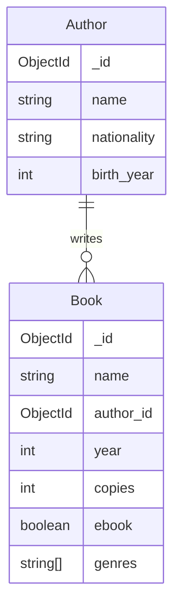

# Database operations in MongoDB

In the third section of the course, we learn the basic database operation in the MongoDB database management system. During this section, your will learn how to perform database operations in the MongoDB database and how to implement relationships between collections.

## CRUD operations

The [CRUD](https://en.wikipedia.org/wiki/Create,_read,_update_and_delete) operations (create, read, update, delete) are the most common database operations in any database management system. Next, let's practice their usage in MongoDB. Before starting the exercises, open the MongoDB Compass application we used during the previous section and open the `library` database in the MongoDB Shell.

> [!IMPORTANT]  
> Exercise 1 👨‍💻: Create a file (for example a Word document) for the exercises in this section. Add the information mentioned in the exercises to the file for a later submission. You can include the database queries as text or [screenshots](https://www.take-a-screenshot.org/) of the MongoDB Shell. Once you are done with the exercises in this section, submit the file to the "Database operations in MongoDB" Moodle submission in PDF format.

### Inserting documents

> [!TIP]  
> While you are reading the MongoDB documentation, choose the language as "MongoDB Shell" from the "Select your language" menu.

Read the [Insert Documents](https://www.mongodb.com/docs/manual/tutorial/insert-documents/) guide. Then, insert a single document to the `book` collection with the following details using the `insertOne` method:

| title                 | author        | year | genres                          | copies | ebook |
| --------------------- | ------------- | ---- | ------------------------------- | ------ | ----- |
| "Pride and Prejudice" | "Jane Austen" | 1813 | "Romance", "Classic", "Fiction" | 3      | false |

The `ebook` attribute value should be a boolean representing whether the book is an ebook version of the book or not. The `genres` attribute value should be an [array](https://www.mongodb.com/docs/manual/tutorial/query-arrays/) representing one or many genres of the book.

Then, list all documents in the `book` collection and make sure that the inserted documents have the correct information. You'll notice that each document has an automatically generated `_id` attribute which act as a primary key. These values are [ObjectId](https://www.mongodb.com/docs/manual/reference/method/ObjectId/) objects, such as `ObjectId("507f1f77bcf86cd799439011")`.

> [!WARNING]  
> Let MongoDB automatically generate a unique value for the `_id` attribute. The attribute will act as a primary key for the document.

Insert the following documents simultaneously using the `insertMany` method:

| title                                               | author                      | year | genres                                                   | copies | ebook |
| --------------------------------------------------- | --------------------------- | ---- | -------------------------------------------------------- | ------ | ----- |
| "War and Peace"                                     | "Leo Tolstoy"               | 1869 | "Historical Fiction", "Classic", "Philosophical Fiction" | 84     | true  |
| "The Lord of the Rings: The Fellowship of the Ring" | "John Ronald Reuel Tolkien" | 1954 | "Fantasy", "Adventure", "Epic"                           | 0      | false |
| "Brave New World"                                   | "Aldous Huxley"             | 1931 | "Dystopian", "Science Fiction", "Classic"                | 11     | false |
| "The Hobbit"                                        | "John Ronald Reuel Tolkien" | 1937 | "Fantasy", "Classic"                                     | 17     | true  |

Then, list all the documents in the `book` collection.

> [!IMPORTANT]  
> Exercise 2 👨‍💻: Save the mentioned two (`insert` and `insertMany`) queries to the submission file.

### Querying documents

Read the [Query Documents](https://www.mongodb.com/docs/manual/tutorial/query-documents/) guide. Then, implement and execute the following queries in the MongoDB Shell:

1. Find the book named "War and Peace"
2. Find the book "War and Peace" using its `_id` attribute (use the document's `_id` attribute value you got from the previous query's result). Note that `ObjectId("507f1f77bcf86cd799439011")` is an `ObjectId` object whereas `"507f1f77bcf86cd799439011"` is a string
3. Find the books which have more than 5 copies. Hint: [Comparison Query Operators](https://www.mongodb.com/docs/manual/reference/operator/query-comparison/#std-label-query-selectors-comparison)
4. Find the books written by the author "John Ronald Reuel Tolkien" before the year 1950
5. Find the books written by either the author "Jane Austen" or "Aldous Huxley". Hint: [Logical Query Operators](https://www.mongodb.com/docs/manual/reference/operator/query-logical/)
6. Find the books that are written after the year 1900 and before the year 2000
7. Find the books with the "Fantasy" genre. Hint: [Query an Array](https://www.mongodb.com/docs/manual/tutorial/query-arrays/)

> [!IMPORTANT]  
> Exercise 3 👨‍💻: Save the mentioned seven queries to the submission file.

### Updating documents

Read the [Update Documents](https://www.mongodb.com/docs/manual/tutorial/update-documents/) guide. Then, implement and execute the following queries in the MongoDB Shell:

1. Change the publishing year of the book named "Brave New World" to 1932
2. Set the number of copies as 0 for all books written by the author "John Ronald Reuel Tolkien"
3. Increase the number of copies of books published after 1900 by two. Hint: [$inc](https://www.mongodb.com/docs/manual/reference/operator/update/inc/) operator
4. Add the genre "Adventure" for the book "The Hobbit". Hint: [$push](https://www.mongodb.com/docs/manual/reference/operator/update/push/#mongodb-update-up.-push) operator
5. Remove the genre "Classics" from the book "Anna Karenina". Hint: [$pull](https://www.mongodb.com/docs/manual/reference/operator/update/pull/) operator

> [!IMPORTANT]  
> Exercise 4 👨‍💻: Save the mentioned five queries to the submission file.

### Deleting documents

Read the [Delete Documents](https://www.mongodb.com/docs/manual/tutorial/remove-documents/) guide. Then, implement and execute the following queries in the MongoDB Shell:

1. Delete the book named "Pride and Prejudice"
2. Delete all the books which have no copies

> [!IMPORTANT]  
> Exercise 5 👨‍💻: Save the mentioned two queries to the submission file.

## Aggregation operations

MongoDB supports similar aggregation operations as SQL's `GROUP BY` clause and aggregation functions such as `COUNT` and `SUM`. Read the [Aggregation Pipeline](https://www.mongodb.com/docs/manual/core/aggregation-pipeline/) guide. Then, implement and execute the following aggregations in the MongoDB Shell:

1. Display the total number of books. Hint: [$group](https://www.mongodb.com/docs/manual/reference/operator/aggregation/group/) and [$count](https://www.mongodb.com/docs/manual/reference/operator/aggregation/count-accumulator/) operators
2. Display the total number of book copies. Hint: [$sum](https://www.mongodb.com/docs/manual/reference/operator/aggregation/sum/) operator
3. Display the number of books by each author
4. Display the number of book copies by each author
5. Display the total number of book copies of books that are ebooks and in the "Romance" category. Hint: [$match](https://www.mongodb.com/docs/manual/reference/operator/aggregation/match/) operator

> [!IMPORTANT]  
> Exercise 6 👨‍💻: Save the mentioned five queries to the submission file.

## Data modeling – embedding data or using references

Let's consider the case where we would need to store more author-related information to the `book` collection, such as the author's nationality and year of birth. We would need to consider whether adding new attributes to the `book` collection or adding a new `author` collection and referencing it from the `book` collection documents. The first approach has issues with data duplication because we would have the same author information in multiple documents causing wasted storage space and high risk of data inconsistency. The latter approach would resemble a foreign key referencing a primary key in a relational database schema and would not introduce similar issues as with the first approach.

Read the [Embedded Data Versus References
](https://www.mongodb.com/docs/manual/data-modeling/concepts/embedding-vs-references/) guide. Then, let's consider how we could implement the reference between the `author` and the `book` collection in our database. Let's assume that we have the following documents in the `author` collection:

| \_id                                 | name                        | birth_year | nationality |
| ------------------------------------ | --------------------------- | ---------- | ----------- |
| ObjectId("6741744df83cf4ce0abb1e9c") | "Leo Tolstoy"               | 1828       | "Russian"   |
| ObjectId("507f1f77bcf86cd799439011") | "John Ronald Reuel Tolkien" | 1892       | "British"   |
| ObjectId("6741745dd39e63730ea251b7") | "Aldous Huxley"             | 1894       | "British"   |
| ObjectId("6741746bbc9c119bcafc58ee") | "Jane Austen"               | 1775       | "British"   |

Now, in the `book` collection the `author_id` attribute can be an `ObjectId` object referencing the corresponding document's `_id` attribute in the `author` collection. For example:

| \_id                                 | title        | author_id                            | year | genres               | copies | ebook |
| ------------------------------------ | ------------ | ------------------------------------ | ---- | -------------------- | ------ | ----- |
| ObjectId("6784c8cdd2cb986c92dbd4ab") | "The Hobbit" | ObjectId("507f1f77bcf86cd799439011") | 1937 | "Fantasy", "Classic" | 17     | true  |

This is a very similar implementation to having a foreign key referencing a primary key in a relational database.

> [!IMPORTANT]  
> Exercise 7 👨‍💻: Read the [Data consistency](https://www.mongodb.com/docs/manual/data-modeling/data-consistency/) documentation. Describe, what kind of problems the lack of [referential integrity](https://www.ibm.com/docs/en/informix-servers/14.10?topic=integrity-referential) support cause in MongoDB for example in the previous example? What kind of application-level measures would be required to achieve data consistency? Consider cases such as creating a `book` document and deleting an `author` document in the previous example.

## Designing data model for the project

Now that we know about the MongoDB data model and the basic database operations, it is time to design a small database of our own. These are the requirements for the project's data model:

- Should consist of at least two collections
- At least two collections should have a relationship (using e.g. a similar "foreign key"-like implementation as in the previous example)
- At least two collections should each have at least three attributes (on top of the `_id` attribute) with more than one different data type (e.g. not only string-type attributes)

Here are a couple of example project ideas for inspiration:

> _"Your friend forgot to buy the snacks for the party again and they could use a shopping list database. A shopping list has a name, description, completion status (is the shopping list completed or not), the name of the store (e.g. "Lidl"), and the name of the shopper. A shopping list contains many items the shopper should buy from the store. Item has a name (e.g. "Chips"), a brand (e.g. "Pringles"), quantity (e.g. 2), one or more categories (e.g. "Dairy products" or "Snacks"), and a purchased status (is the item purchased or not)"_

> _"Your teacher needs a database for keeping track on students' grades in different courses. A course has a name, teacher's name, credits, year, semeter (e.g. "Spring"), language (e.g. "English") and one more topics (e.g. "Python" or "MongoDB"). A course has many gradings for different students. A grading has a student's name, student number, grade (between 0 and 5), and comment (free form textual comment regarding the grading)."_

Come up with your own database or use the ideas above. Feel free to make any modifications. Once you have designed the database schema, create a database and the collections in MongoDB Compass. Then, insert a few documents to each collections using the MongoDB Shell.

> [!WARNING]  
> The library database used in the previous exercises isn't suitable for the project. Come up with your own project idea or use and modify the examples above.

> [!IMPORTANT]  
> Exercise 8 👨‍💻: Implement an [entity relationship diagram](https://www.lucidchart.com/pages/er-diagrams) for your project's data model in the format you prefer. Include the names of the entities, their relationships, their attributes, and data types. Add an image of the diagram to the submission file.

> [!WARNING]  
> Don't use whitespace (e.g. space between words) in database, collection or attributes names. You can use the `_` symbol as a word separator e.g. attribute name `birth_year`, _not_ `birth year`.

> [!IMPORTANT]  
> Exercise 9 👨‍💻: Create a database for your project and add the collections in the MongoDB Compass. Then, insert a few documents into each collection as test data using the MongoDB Shell. Take a screenshot of the database view in the MongoDB Compass (visible after clicking the database name on the connections list) and add it to the submission file. Revisit [Manage Databases in Compass](https://www.mongodb.com/docs/compass/current/databases/), [Manage Collections in Compass](https://www.mongodb.com/docs/compass/current/collections/) and [Insert Documents](https://www.mongodb.com/docs/manual/tutorial/insert-documents/) guides if you have trouble.

⏭️ [Move on to the final section](./4-mongo-python.md)
