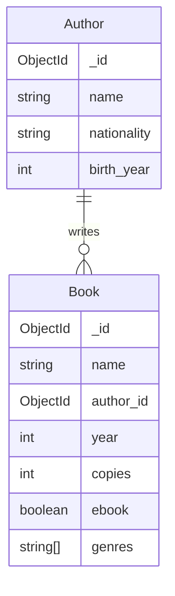

# Database operations and data model in MongoDB

In the third section of the course, we learn the basic database operation in the MongoDB database management system. We will also cover the core concepts of the MongoDB data model. During this section, you will learn how to perform CRUD and aggregation operations in the MongoDB database and how to use embedded documents and document references in the MongoDB data model. You will also design and set up a database for your project.

## CRUD operations

The [CRUD](https://en.wikipedia.org/wiki/Create,_read,_update_and_delete) operations (create, read, update, delete) are the most common database operations in any database management system. Next, let's practice their usage in MongoDB. Before starting the exercises, open the MongoDB Compass application we used during the previous section and open the `library` database in the MongoDB Shell.

> [!IMPORTANT]  
> Exercise 1 👨‍💻: Create a file (for example a Word document) for the exercises in this section. Add the information mentioned in the exercises to the file for a later submission. You can include the database queries as text or [screenshots](https://www.take-a-screenshot.org/) of the MongoDB Shell. Once you are done with the exercises in this section, submit the file to the "Database operations in MongoDB" Moodle submission in PDF format.

### Inserting documents

> [!WARNING]  
> While you are reading the MongoDB documentation, choose the language as "MongoDB Shell" from the "Select your language" menu.

Read the [Insert Documents](https://www.mongodb.com/docs/manual/tutorial/insert-documents/) guide. Then, insert a single document to the `books` collection with the following details using the `insertOne` method:

| title                 | author        | year | genres                          | copies | ebook |
| --------------------- | ------------- | ---- | ------------------------------- | ------ | ----- |
| "Pride and Prejudice" | "Jane Austen" | 1813 | "Romance", "Classic", "Fiction" | 3      | false |

The `ebook` attribute value should be a boolean representing whether the book is an ebook version of the book or not. The `genres` attribute value should be an [array](https://www.mongodb.com/docs/manual/tutorial/query-arrays/) representing one or many genres of the book.

Then, list all documents in the `books` collection and make sure that the inserted documents have the correct information. You'll notice that each document has an automatically generated `_id` attribute which act as a primary key. These values are [ObjectId](https://www.mongodb.com/docs/manual/reference/method/ObjectId/) objects, such as `ObjectId("507f1f77bcf86cd799439011")`.

> [!WARNING]  
> Let MongoDB automatically generate a unique value for the `_id` attribute. The attribute will act as a primary key for the document.

Insert the following documents simultaneously using the `insertMany` method:

| title                                               | author                      | year | genres                                                   | copies | ebook |
| --------------------------------------------------- | --------------------------- | ---- | -------------------------------------------------------- | ------ | ----- |
| "War and Peace"                                     | "Leo Tolstoy"               | 1869 | "Historical Fiction", "Classic", "Philosophical Fiction" | 84     | true  |
| "The Lord of the Rings: The Fellowship of the Ring" | "John Ronald Reuel Tolkien" | 1954 | "Fantasy", "Adventure", "Epic"                           | 0      | false |
| "Brave New World"                                   | "Aldous Huxley"             | 1932 | "Dystopian", "Science Fiction", "Classic"                | 20     | true  |
| "The Hobbit"                                        | "John Ronald Reuel Tolkien" | 1930 | "Fantasy", "Adventure", "Classic"                        | 17     | false |

Then, list all the documents in the `books` collection.

> [!IMPORTANT]  
> Exercise 2 👨‍💻: Save the mentioned two queries (`insert` and `insertMany`) to the submission file.

### Querying documents

Read the [Query Documents](https://www.mongodb.com/docs/manual/tutorial/query-documents/) guide. Then, implement and execute the following queries in the MongoDB Shell:

<!--
Read the [Query Documents](https://www.mongodb.com/docs/manual/tutorial/query-documents/) and the [cursor.sort()](https://www.mongodb.com/docs/manual/reference/method/cursor.sort/) guides. Then, implement and execute the following queries in the MongoDB Shell:
-->

1. Find the book "To Kill a Mockingbird"
2. Find the book "To Kill a Mockingbird" using its `_id` attribute (use the document's `_id` attribute value you got from the previous query's result). Note that `ObjectId("507f1f77bcf86cd799439011")` is an `ObjectId` object whereas `"507f1f77bcf86cd799439011"` is a string
3. Find the books that have more than fifteen copies. Hint: [Comparison Query Operators](https://www.mongodb.com/docs/manual/reference/operator/query-comparison/#std-label-query-selectors-comparison) <!-- Sort the books in ascending order by the number copies -->
4. Find the books written by the author "Leo Tolstoy" before the year 1890 <!-- Sort the books in descending order by the publishing year  -->
5. Find the books written by either the author "Jane Austen" or "Aldous Huxley". Hint: [Logical Query Operators](https://www.mongodb.com/docs/manual/reference/operator/query-logical/) <!-- Sort the books in ascending order by the author's name and in descending order by the publishing year -->
6. Find the books that are published after the year 1950 and before the year 2020
7. Find the books that have either the "Thriller" or the "Drama" genre. Hint: [Query an Array](https://www.mongodb.com/docs/manual/tutorial/query-arrays/)

> [!IMPORTANT]  
> Exercise 3 👨‍💻: Save the mentioned seven queries to the submission file.

### Updating documents

Read the [Update Documents](https://www.mongodb.com/docs/manual/tutorial/update-documents/) guide. Then, implement and execute the following queries in the MongoDB Shell:

> [!NOTE]
> Choose the update operation based on the number of documents you intend to update (one or many).

1. Change the publishing year of the book "The Hobbit" to 1937 and the ebook status to true
2. Set the number of copies as zero for all books written by the author "John Ronald Reuel Tolkien"
3. Increase the number of copies of books published after the year 1920 by two, _without reading the current values_. Hint: [$inc](https://www.mongodb.com/docs/manual/reference/operator/update/inc/) operator
4. Add the genre "American literature" for all books written by the author "Colleen Hoover", _without reading the current value_. Hint: [$push](https://www.mongodb.com/docs/manual/reference/operator/update/push/#mongodb-update-up.-push) operator
5. Remove the genre "Non-fiction" from the book "Island", _without reading the current value_. Hint: [$pull](https://www.mongodb.com/docs/manual/reference/operator/update/pull/) operator

> [!IMPORTANT]  
> Exercise 4 👨‍💻: Save the mentioned five queries to the submission file.

### Deleting documents

Read the [Delete Documents](https://www.mongodb.com/docs/manual/tutorial/remove-documents/) guide. Then, implement and execute the following queries in the MongoDB Shell:

> [!NOTE]
> Choose the delete operation based on the number of documents you intend to delete (one or many). This avoids accidentally deleting too many documents.

1. Delete the book "Pride and Prejudice"
2. Delete all the books which have no copies and are ebooks

> [!IMPORTANT]  
> Exercise 5 👨‍💻: Save the mentioned two queries to the submission file.

## Aggregation operations

MongoDB supports similar aggregation operations as SQL's `GROUP BY` clause and aggregation functions such as `COUNT` and `SUM`. Read the [Aggregation Pipeline](https://www.mongodb.com/docs/manual/core/aggregation-pipeline/) guide. Then, implement and execute the following aggregations in the MongoDB Shell:

1. Display the total number of books. Hint: [$group](https://www.mongodb.com/docs/manual/reference/operator/aggregation/group/) and [$count](https://www.mongodb.com/docs/manual/reference/operator/aggregation/count-accumulator/) operators including the examples in both guides
2. Display the total number of book copies. Hint: [$sum](https://www.mongodb.com/docs/manual/reference/operator/aggregation/sum/) operator
3. Display the number of books by each author
4. Display the number of book copies by each author <!-- Sort the authors by the number of their book copies in descending order and by their name in ascending order. Hint: [$sort](https://www.mongodb.com/docs/manual/reference/operator/aggregation/sort/) -->
5. Display the total number of book copies of books that are not ebooks and have the "Romance" category. Hint: [$match](https://www.mongodb.com/docs/manual/reference/operator/aggregation/match/) operator. Pay attention to the order of the aggregation operations (that is, the order of the aggregation operation objects in the argument array)
6. ⭐ Bonus: display the publishing year of each author's first and latest book. Hint: find suitable [aggregation operators](https://www.mongodb.com/docs/manual/reference/operator/aggregation/) for finding the minimum and maximum value of documents

> [!IMPORTANT]  
> Exercise 6 👨‍💻: Save the mentioned five queries to the submission file.

## Data modeling – embedding data or using references

Let's consider the case where we would need to store more author-related information to the `books` collection, such as the author's nationality and year of birth. We would need to consider whether adding new attributes to the `books` collection or adding a new `authors` collection and referencing it from the `books` collection documents. With the first approach, we could represent the author as an object with the required information. Let's for example consider the following `books` document:

```json
{
  "_id": "6784c8cdd2cb986c92dbd4ab",
  "title": "The Hobbit",
  "year": 1937,
  "genres": ["Fantasy", "Classic"],
  "copies": 17,
  "ebook": true,
  "author": {
    "name": "John Ronald Reuel Tolkien",
    "birth_year": 1892,
    "nationality": "British"
  }
}
```

The first approach has issues with data duplication because we would have the same author information in multiple documents (e.g. all books of the author John Ronald Reuel Tolkien) causing wasted storage space and high risk of data inconsistency (e.g. while updating author's information). The latter approach would resemble a foreign key referencing a primary key in a relational database schema and would not introduce similar issues as with the first approach. The following database diagram visualizes the database structure in the mentioned approach:


```mermaid
erDiagram
    Author ||--o{ Book : writes

    Author {
        ObjectId _id
        string name
        string nationality
        int birth_year
    }

    Book {
        ObjectId _id
        string name
        ObjectId author_id
        int year
        int copies
        boolean ebook
        string[] genres
    }
```

Read the [Embedded Data Versus References](https://www.mongodb.com/docs/manual/data-modeling/concepts/embedding-vs-references/) guide. Then, let's consider how we could implement the relationship between the `authors` and the `books` collection in our database using a reference. Let's assume that we have the following documents in the `authors` collection:

| \_id                                 | name                        | birth_year | nationality |
| ------------------------------------ | --------------------------- | ---------- | ----------- |
| ObjectId("6741744df83cf4ce0abb1e9c") | "Leo Tolstoy"               | 1828       | "Russian"   |
| ObjectId("507f1f77bcf86cd799439011") | "John Ronald Reuel Tolkien" | 1892       | "British"   |
| ObjectId("6741745dd39e63730ea251b7") | "Aldous Huxley"             | 1894       | "British"   |
| ObjectId("6741746bbc9c119bcafc58ee") | "Jane Austen"               | 1775       | "British"   |

Now, in the `books` collection the `author_id` attribute can be an `ObjectId` object referencing the corresponding document's `_id` attribute in the `authors` collection. For example:

| \_id                                 | title        | author_id                            | year | genres               | copies | ebook |
| ------------------------------------ | ------------ | ------------------------------------ | ---- | -------------------- | ------ | ----- |
| ObjectId("6784c8cdd2cb986c92dbd4ab") | "The Hobbit" | ObjectId("507f1f77bcf86cd799439011") | 1937 | "Fantasy", "Classic" | 17     | true  |

Here's the same document in the JSON format:

```json
{
  "_id": "6784c8cdd2cb986c92dbd4ab",
  "title": "The Hobbit",
  "year": 1937,
  "genres": ["Fantasy", "Classic"],
  "copies": 17,
  "ebook": true,
  "author_id": "507f1f77bcf86cd799439011"
}
```

This is a very similar implementation to having a foreign key referencing a primary key in a relational database. It is worth noting, however, that _in MongoDB there's no foreign key concept_ and because of that, no foreign key constraints.

The [MongoDB Relationships](https://dev.to/chafroudtarek/mongodb-relationshipsone-to-oneone-to-manymany-to-many-njc) article covers more examples of different kinds of relationships between collections, for example, how to implement many-to-many relationships. The article describes the reference approach, but it is always possible to use embedded documents as well. However, it is worth noting the possible drawbacks mentioned above.

> [!IMPORTANT]  
> Exercise 7 👨‍💻: Read the [Data consistency](https://www.mongodb.com/docs/manual/data-modeling/data-consistency/) documentation. Describe, what kind of problems the lack of [referential integrity](https://www.ibm.com/docs/en/informix-servers/14.10?topic=integrity-referential) support cause in MongoDB for example in the previous example? What kind of application-level measures would be required to achieve data consistency? You can consider cases such as creating a `books` collection document and deleting an `authors` collection document in the previous example.

> [!NOTE]  
> The [$lookup](https://www.mongodb.com/docs/manual/reference/operator/aggregation/lookup/) aggregation operation is the closest thing to RDMS's joins in MongoDB. It can be used to "join" documents from other collections using a reference key (e.g. joining an `authors` collection document into a `books` collection document based on the `author_id` attribute).

## Designing data model for the project

Now that we know about the MongoDB data model and the basic database operations, it is time to design a small database of our own. These are the requirements for the project's data model:

- Should consist of at least two collections
- At least one relationship between two collections should be implemented using an id reference (like with the `books` and `authors` collections in the example above). Otherwise, feel free to use embedded documents as well
- At least two collections should each have at least three attributes (on top of the `_id` attribute) with more than one different data type (e.g. not only string-type attributes)

Here are some examples of project ideas for inspiration:

> _"Your friend forgot to buy the snacks for the party again and they could use a shopping list database. A shopping list has a name, description, completion status (is the shopping list completed or not), the name of the store (e.g. "Lidl"), and the name of the shopper. A shopping list contains many items the shopper should buy from the store. Item has a name (e.g. "Chips"), a brand (e.g. "Pringles"), quantity (e.g. 2), one or more tags (e.g. "Dairy products" or "Snacks"), and a purchased status (is the item purchased or not)."_

> _"Your teacher needs a database to track students' grades in different courses. A course has a name, teacher's name, credits, year, semester (e.g. "Spring"), language (e.g. "English"), and one more topics (e.g. "Python" or "MongoDB"). A course has many gradings for different students. A student grading has a student's name, student number, grade (between 0 and 5), and comment (teacher's free form textual comment regarding the grading)."_

Come up with your own database or use the ideas above. Feel free to make any modifications. Once you have designed the database schema, create a database and the collections in MongoDB Compass. Then, insert a few documents into each collection using the MongoDB Shell.

> [!WARNING]  
> The library database used in the previous exercises isn't suitable for the project. Come up with your own project idea or use the examples above with possible modifications.

> [!IMPORTANT]  
> Exercise 8 👨‍💻: Implement an [entity relationship diagram](https://www.lucidchart.com/pages/er-diagrams) for your project's data model in the format you prefer. Include the names of the entities, their relationships, their attributes, and data types. Add an image of the diagram to the submission file.

> [!WARNING]  
> Don't use whitespace (e.g. space between words) in database, collection, or attribute names. You can use the `_` symbol as a word separator e.g. attribute name `birth_year`, _not_ `birth year`. Collection names are commonly in plural form e.g. collection name `books`, _not_ `book`.

> [!IMPORTANT]  
> Exercise 9 👨‍💻: Create a database for your project and add the collections in the MongoDB Compass. Then, insert a few documents into each collection as test data using the MongoDB Shell. Take a screenshot of the database view in the MongoDB Compass (visible after clicking the database name on the connections list) and add it to the submission file. Revisit [Manage Databases in Compass](https://www.mongodb.com/docs/compass/current/databases/), [Manage Collections in Compass](https://www.mongodb.com/docs/compass/current/collections/) and [Insert Documents](https://www.mongodb.com/docs/manual/tutorial/insert-documents/) guides if you have trouble.

⏭️ [Move on to the final section](./4-mongo-python.md)
