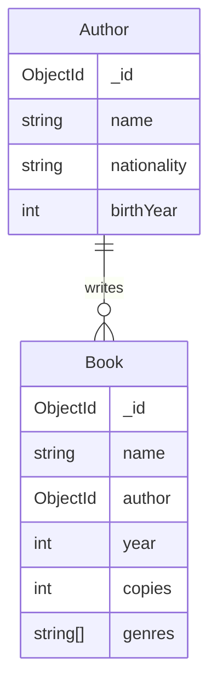

# Database operations in MongoDB

In the third section of the course we learn the basic database operation in the MongoDB database management system. During this section your will learn how to perform database operations in the MongoDB database and how to implement relationships between collections.

## CRUD operations

The [CRUD](https://en.wikipedia.org/wiki/Create,_read,_update_and_delete) operations (create, read, update, delete) are the most common database operations in any database management system. Next, let's practice their usage in MongoDB. Before starting the exercises, oven the MongoDB Compass application we used during the previous section and open the `library` database in MongoDB Shell.

> [!IMPORTANT]  
> Exercise 1 👨‍💻: Create a file `part3` (for example a Word document) for the exercises in this section. Add the information mentioned in the exercises to the file for a later submission. You can include the database queries as text or [screenshots](https://www.take-a-screenshot.org/) of MongoDB Shell. Once you are done with the exercises in this section, submit the file to [this Moodle submission](#TODO).

### Inserting documents

> [!TIP]  
> While you are reading the MongoDB documentation, choose the language as "MongoDB Shell" from the "Select your language" menu.

Read the [Insert Documents](https://www.mongodb.com/docs/manual/tutorial/insert-documents/) guide. Then, insert a single document to the `book` collection with the following details using the `insertOne` method:

| title                 | author        | year | genres                            | copies |
| --------------------- | ------------- | ---- | --------------------------------- | ------ |
| "Pride and Prejudice" | "Jane Austen" | 1813 | ["Romance", "Classic", "Fiction"] | 3      |

Then, list all documents in the `book` collection. You'll notice that each document has an automatically generated `_id` attribute which act as a primary key. These values are [ObjectId](https://www.mongodb.com/docs/manual/reference/method/ObjectId/) objects, such as `ObjectId("507f1f77bcf86cd799439011")`.

> [!WARNING]  
> Let MongoDB automatically generate a unique value for the `_id` attribute. The attribute will act as a primary key for the document.

Insert the following documents using the `insertMany` method:

| title                   | author                      | year | genres                                                     | copies |
| ----------------------- | --------------------------- | ---- | ---------------------------------------------------------- | ------ |
| "War and Peace"         | "Leo Tolstoy"               | 1869 | ["Historical Fiction", "Classic", "Philosophical Fiction"] | 84     |
| "The Lord of the Rings: The Fellowship of the Ring" | "John Ronald Reuel Tolkien" | 1954 | ["Fantasy", "Adventure", "Epic"]                           | 0      |
| "Brave New World"       | "Aldous Huxley"             | 1931 | ["Dystopian", "Science Fiction", "Classic"]                | 11     |
| "The Hobbit"            | "John Ronald Reuel Tolkien" | 1937 | ["Fantasy", "Classic"]                                     | 17     |

Then, list the all the documents in the `book` collection.

> [!IMPORTANT]  
> Exercise 2 👨‍💻: Save the mentioned two (`insert` and `insertMany`) queries to the file.

### Querying documents

Read the [Query Documents](https://www.mongodb.com/docs/manual/tutorial/query-documents/) guide. Then, implement and execute the following queries in MongoDB Shell:

1. Find the book named "War and Peace"
2. Find out what's the `_id` attribute value of the book "War and Peace". Then, find the book based on that `_id`. Note that `ObjectId("507f1f77bcf86cd799439011")` is an `ObjectId` object whereas `"507f1f77bcf86cd799439011"` is a string
3. Find books which are published after year 1900. Hint: [Comparison Query Operators
](https://www.mongodb.com/docs/manual/reference/operator/query-comparison/#std-label-query-selectors-comparison)
4. Find books with more than 0 copies. Note that `0` is a number whereas `"0"` is a string
5. Find the books written by author "John Ronald Reuel Tolkien" before year 1950
6. Find the books in "Fantasy" genre. Hint: [Query an Array](https://www.mongodb.com/docs/manual/tutorial/query-arrays/)
7. Find the books written by either the author "Jane Austen" or "Aldous Huxley"

> [!IMPORTANT]  
> Exercise 3 👨‍💻: Save the mentioned seven queries to the file.

### Updating documents

Read the [Update Documents](https://www.mongodb.com/docs/manual/tutorial/update-documents/) guide. Then, implement and execute the following queries in MongoDB Shell:

1. Change the publishing year of the book "Brave New World" to 1932
2. Set the number of copies as 0 for all books written by the author "John Ronald Reuel Tolkien"
3. Increase the number of copies of books published after 1900 by two. Hint: [$inc](https://www.mongodb.com/docs/manual/reference/operator/update/inc/) operator
4. Add the genre "Adventure" for the book "The Hobbit". Hint: [$push](https://www.mongodb.com/docs/manual/reference/operator/update/push/#mongodb-update-up.-push) operator
5. Remove the genre "Classic" from the book "War and Peace". Hint: [$pull](https://www.mongodb.com/docs/manual/reference/operator/update/pull/) operator

> [!IMPORTANT]  
> Exercise 4 👨‍💻: Save the mentioned five queries to the file.

### Deleting documents

Read the [Delete Documents](https://www.mongodb.com/docs/manual/tutorial/remove-documents/) guide. Then, implement and execute the following queries in MongoDB Shell:

1. Delete the book "Pride and Prejudice"
2. Delete all the books which have no copies

> [!IMPORTANT]  
> Exercise 5 👨‍💻: Save the mentioned two queries to the file.

## Aggregation operations

MongoDB supports similar aggregation operations as SQL's `GROUP BY` clause and aggregation functions such as `COUNT` and `SUM`. Read the [Aggregation Pipeline](https://www.mongodb.com/docs/manual/core/aggregation-pipeline/) guide. Then, implement and execute the following aggregations in MongoDB Shell:

1. Display the total number of books in the library. Hint: [$group](https://www.mongodb.com/docs/manual/reference/operator/aggregation/group/) (take a look at the [examples](https://www.mongodb.com/docs/manual/reference/operator/aggregation/group/#examples)) and [$count](https://www.mongodb.com/docs/manual/reference/operator/aggregation/count-accumulator/) operators
2. Display the total number of book copies in the libary. Hint: [$sum](https://www.mongodb.com/docs/manual/reference/operator/aggregation/sum/) operator
3. Display the number of books by each author
4. Display the number of book copies by each author
5. Display the number of book copies in the "Fantasy" category. Hint: [$match](https://www.mongodb.com/docs/manual/reference/operator/aggregation/match/) operator

> [!IMPORTANT]  
> Exercise 6 👨‍💻: Save the mentioned five queries to the file.

## Data modeling – embedding data or using references

Let's consider the case where we would need to store more author-related information to the `book` collection, such as the author's nationality and year of birth. We would need to consider whether adding new attributes to the `book` collection or adding a new `author` collection and referencing it from the `book` collection documents. The first approach has issues with data duplication because we would have the same author information in multiple documents causing wasted storage space and high risk of data inconsistency. The latter approach would resemble a foreign key referencing a primary key in a relational database schema and would not introduce similar issues as with the first approach.

Read the [Embedded Data Versus References
](https://www.mongodb.com/docs/manual/data-modeling/concepts/embedding-vs-references/) guide. Then, let's consider how we could implement the reference between the `author` and the `book` collection in our database. Let's assume that we have the following documents in the `author` collection:

| _id | name                        | birthYear | nationality |
| -- | --------------------------- | --------- | ----------- |
| ObjectId("6741744df83cf4ce0abb1e9c") | "Leo Tolstoy"               | 1828      | "Russian"   |
| ObjectId("507f1f77bcf86cd799439011") | "John Ronald Reuel Tolkien" | 1892      | "British"   |
| ObjectId("6741745dd39e63730ea251b7") | "Aldous Huxley"             | 1894      | "British"   |
| ObjectId("6741746bbc9c119bcafc58ee") | "Jane Austen"               | 1775      | "British"   |

Now, in the `book` collection the `author` attribute can be an `ObjectId` object referencing the corresponding document's `_id` attribute in the `author` collection. For example:

| title        | author                               | year | genres                 | copies |
| ------------ | ------------------------------------ | ---- | ---------------------- | ------ |
| "The Hobbit" | ObjectId("507f1f77bcf86cd799439011") | 1937 | ["Fantasy", "Classic"] | 17     |

This is a very similar implementation to having a foreign key referencing a primary key in a relational database.

<!--
> [!WARNING] 
> It is worth noting however, that MongoDB doesn't support [referential integrity](https://www.ibm.com/docs/en/informix-servers/14.10?topic=integrity-referential) or join operations. We could for example delete an `author` document without any error and the referencing documents in the `book` collection would have an `ObjectId` in the `author` attribute, which doesn't have a corresponding document in the `author` collection. The [Data consistency](https://www.mongodb.com/docs/manual/data-modeling/data-consistency/) documentation covers the topic in more detail.
-->

> [!IMPORTANT]  
> Exercise 7 👨‍💻: Read the [Data consistency](https://www.mongodb.com/docs/manual/data-modeling/data-consistency/) documentation. Describe, what kind of problems the lack of [referential integrity](https://www.ibm.com/docs/en/informix-servers/14.10?topic=integrity-referential) support cause in MongoDB for example in the previous example? What kind of application-level measures would be required to achieve data consistency? Consider cases such as creating a `book` document and deleting an `author` document in the previous example.       

## Designing data model for the project

Now that we know about the MongoDB data model and the basic database operations, it is time to design a small database of our own. The database should consist of _at least two collections_. Here are a couple of examples for inspiration:

- Your fellow students need a database for storing information about the courses they have completed. A student has a first name, last name, city (e.g. "Helsinki"), major subject (e.g. "Computer science"), and one or more minor subjects. Students have many course completions. A course completion has a course name, teacher's name, credits, year, semester (e.g. "Spring"), and grade
- Your friend forgot to buy the drinks for the party again and they could use a shopping list database. A shopping list has a name, description, status (either "complete" or "incomplete"), and the name of the shopper. A shopping list contains many items the shopper should buy from the store. Items have a name (e.g. "Milk"), quantity (e.g. 2), one or more categories (e.g. "Dairy products"), and a purchased status (is the item purchased or not)

Come up with your own database or use the ideas above. Feel free to make any modifications. Once you have designed the database schema, insert some data into the database with the MongoDB Shell.

> [!WARNING]  
> The library database used in the previous exercises isn't suitable for the project.

> [!IMPORTANT]  
> Exercise 8 👨‍💻: Implement an [entity relationship diagram](https://www.lucidchart.com/pages/er-diagrams) for your project's data model in the format you prefer. Include the names of the entities, their relationships, their attributes, and data types. Add an image of the diagram to the file.

⏭️ [Move on to the final section](./4-mongo-python.md)
